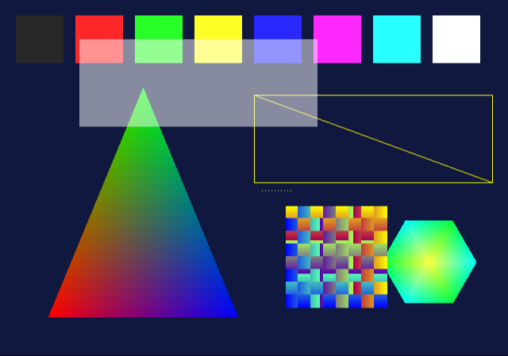
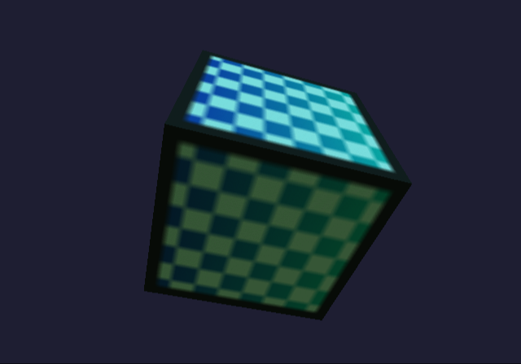
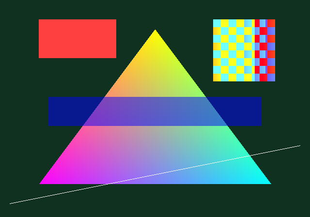
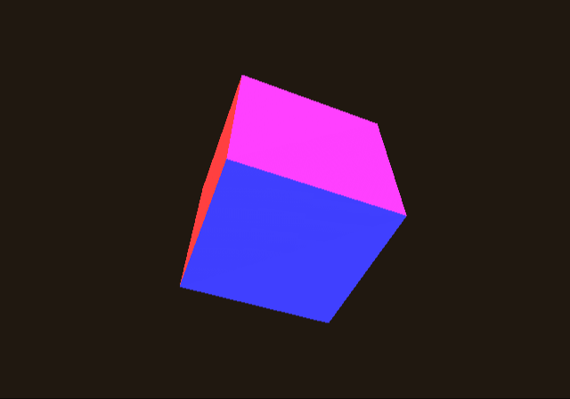
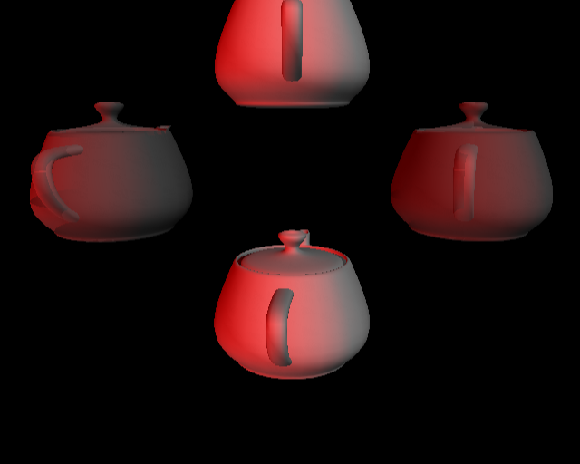
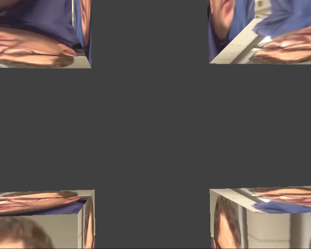

# AnyPS2

Recompilador estático de PlayStation 2 para PC (Windows e Linux), no
espírito do [AnyPS5](https://github.com/boykopovar/AnyPS5) e do N64Recomp.

O PS5 e o PC compartilham a arquitetura x86-64, então o AnyPS5 consegue
"relinkar" o executável. No PS2 a CPU principal é um **MIPS R5900 (Emotion
Engine)**, então o código precisa ser **traduzido**:

```
ELF do PS2  ──▶  C++ gerado  ──▶  compilador nativo  ──▶  executável PC
                     │
                     └── linka o runtime do AnyPS2 (kernel do EE em HLE,
                         memória, GS, VU, IOP, SPU2, pad, CDVD...)
```

> **Status: Fases 1 a 6 concluídas.** Homebrews do ps2dev — de console
> (printf, threads, timers, arquivos), gráficos 2D/3D (libgraph/libdraw e
> gsKit), com os Vector Units (libmath3d no VU0, microprogramas do VU1) e
> agora com controle, memory card, disco (ISO) e som — são recompilados e
> rodam nativos, com o Graphics Synthesizer e o SPU2 emulados em software e
> janela/áudio/controles via SDL2. **Fase 7 em andamento:** o boot do
> Gran Turismo 4 (dump do usuário) recompilado desenha a tela de copyright,
> descomprime e executa o programa principal (também recompilado: 1,4 M
> instruções), inicializa controles e memory card, lê os dados do disco
> pelos drivers da Polyphony (em HLE; o driver de som já toca os efeitos dos
> menus, ainda sem a música) e, guiado por um roteiro de
> controle, passa pela seleção de idioma, cria o save no memory card, recebe
> o nome do jogador, toca o vídeo de abertura (MPEG-2 decodificado pelo IPU
> emulado), entra no modo Arcade (menu com fundos em vídeo, seleção de carro,
> vitrine 3D) e começa uma corrida, ainda lenta e com defeitos de textura.
> Jogos
> comerciais ainda não são jogáveis: eles trazem drivers próprios para o
> IOP, que ainda não executa código (ver [O que falta](#o-que-falta)). Veja o
> [PLANO.md](PLANO.md) para o roteiro completo.

| `gfx2d` (libgraph + libdraw) | `cube3d` (Z-buffer, textura em perspectiva) | `gskit` |
|---|---|---|
|  |  |  |

| `vu1draw` (microprograma do VU1 + XGKICK) | sample `draw/teapot` do ps2sdk | sample `vu1/` do ps2sdk |
|---|---|---|
|  |  |  |

Essas imagens são a saída real dos homebrews recompilados (e as
referências que os testes comparam byte a byte).

## Experimente

```sh
cmake -S . -B build -DCMAKE_BUILD_TYPE=Release && cmake --build build
build/tools/anyps2 recomp tests/homebrew/hello/hello.elf -o /tmp/hello
cmake -S /tmp/hello -B /tmp/hello/build && cmake --build /tmp/hello/build
/tmp/hello/build/hello a b
# Ola do PS2! argc=3
```

O `hello.elf` é um homebrew comum do ps2dev (`printf` do newlib). No
executável nativo, o `printf` percorre o mesmo caminho que no console: newlib
→ libcglue → `fioWrite` → SIF RPC → servidor fileio do IOP (aqui em HLE) →
stdout.

Com gráficos (abre uma janela; feche-a para sair):

```sh
build/tools/anyps2 recomp tests/homebrew/cube3d/cube3d.elf -o /tmp/cube3d
cmake -S /tmp/cube3d -B /tmp/cube3d/build && cmake --build /tmp/cube3d/build
/tmp/cube3d/build/cube3d
# ou sem janela, gravando a imagem final:
ANYPS2_VIDEO=none ANYPS2_SCREENSHOT=cubo.png /tmp/cube3d/build/cube3d
```

Controles, memory card, disco e som (Fase 6):

```sh
# teclado: setas, Z=✕ X=○ A=□ S=△, Q/W=L1/R1, 1/2=L2/R2, Enter=START,
# Backspace=SELECT; ou um controle (SDL_GameController)
ANYPS2_ISO=meu_dump.iso ./jogo          # disco: cdrom0: e libcdvd
ANYPS2_MC_DIR=~/cartoes ./jogo          # memory cards em ~/cartoes/mc0, mc1
ANYPS2_AUDIO_WAV=som.wav ./jogo         # grava o som (além dos alto-falantes)
ANYPS2_PAD_SCRIPT=roteiro.txt ./jogo    # entrada determinística (testes)
```

## O que funciona hoje

### Fase 6 — IOP em HLE: módulos, controle, memory card, disco e som

O IOP não executa código: os módulos são reimplementados por protocolo RPC
(a partir do ps2sdk, sem nada da Sony) e "carregar" um IRX registra os
servidores da implementação HLE.

- **Módulos**: `SifLoadModule` (`rom0:`, `host:`, `cdrom0:`),
  `SifExecModuleBuffer` (IRX embutido), `SifSearchModuleByName`. O IRX é
  identificado pelo nome gravado nele; **sem implementação HLE é erro claro**
  com nome, versão e origem (ex.: `módulo IRX "USB_driver" v2.4 ... não tem
  implementação HLE`).
- **Controles** (`padman`, protocolos do XPADMAN e do PADMAN da ROM):
  DualShock 2 com modos digital/analógico/pressão, pelo teclado ou
  controle (SDL), ou por roteiro (`ANYPS2_PAD_SCRIPT`).
- **Memory card** (`mcserv`, libmc): pastas do host (`ANYPS2_MC_DIR`),
  arquivos, pastas, listagem com curinga, renomear, apagar, espaço livre.
- **Disco** (`cdvdfsv`, libcdvd): ISO própria em `ANYPS2_ISO` (2048 ou
  2352 bytes/setor), ISO 9660 nosso, `sceCdSearchFile`/`sceCdRead`/relógio e
  `cdrom0:` no fopen/open/stat/opendir.
- **Som**: SPU2 em software (48 vozes ADPCM, ADSR, pitch, mixagem a
  48 kHz) e `audsrv` (PCM com conversão de taxa e espera bloqueante,
  samples ADPCM). O mixer roda no tempo emulado — no relógio virtual o WAV
  sai idêntico sempre. Saída: SDL (`ANYPS2_AUDIO=sdl|none`) e/ou WAV
  (`ANYPS2_AUDIO_WAV`).

Limitações: drivers IRX próprios de jogos, `sdrdrv`/libsdr, reverb, CD-DA,
multitap e o callback `audsrv_on_fillbuf` não existem (erro claro);
interpolação de amostras cúbica em vez da tabela gaussiana do chip;
leituras de disco instantâneas; `mc0:` só pelo libmc. Detalhes no
[PLANO.md](PLANO.md#fase-6--iop-em-hle-).

### Fase 5 — Vector Units (VU0/VU1)

- **Núcleo do VU** com a aritmética do PS2 (sem NaN/Inf, saturação, flags e
  **truncamento** exato — o mesmo código agora serve a FPU do EE) e modelo de
  pipeline: stalls de VF, flags MAC/status/clip com 4 ciclos de atraso, Q e
  P (FDIV/EFU) com as latências do hardware, WAITQ/WAITP, upper e lower em
  paralelo, LOI, bit E e delay slots.
- **VU0 em modo macro**: cada instrução COP2 do EE (`vadd`, `vmula`, `vdiv`,
  `vclip`, `viadd`, `vlqi`...) é recompilada como chamada ao núcleo;
  `CFC2/CTC2`, `VCALLMS/VCALLMSR` (VU0 em modo micro).
- **VU1**: `MSCAL/MSCNT` pelo VIF1 com double buffering, `XTOP/XITOP`,
  `XGKICK` (PATH1 para o GIF).
- **Microcódigo recompilado em C++**: `anyps2 recomp` acha o microcódigo no
  ELF (pacotes VIF `MPG` e blocos montados em tempo de execução) e gera C++
  com cada par especializado pelas suas operações. O runtime casa a micro
  memória com os blocos pelo conteúdo (não importa onde o programa foi
  carregado) e confere cada par antes de executar; o que não bate vai para o
  interpretador. Microcódigo que só aparece em tempo de execução pode ser
  gravado com `ANYPS2_VU_DUMP=dir` e incluído com `--vu-dumps dir`.
  **Ganho medido: ~1,1x** sobre o interpretador — o custo está na semântica
  (truncamento, flags, pipeline), não na decodificação; detalhes e o caminho
  para ganho real no [PLANO.md](PLANO.md#fase-5--vu0vu1-e-recompilação-de-microcódigo-).
- O evento FINISH do GS agora respeita o tempo de trabalho do GS (o sample
  `draw/teapot` do ps2sdk travava com ele instantâneo).

Variáveis de ambiente: `ANYPS2_VU=interp` (só interpretador),
`ANYPS2_VU=compiled` (erro se algum par não estiver recompilado),
`ANYPS2_VU_DUMP=dir`, `ANYPS2_FRAMES=N` (encerra no N-ésimo VBlank).

### Fase 4 — gráficos

- **DMAC**: canais VIF0/VIF1/GIF/SPR em modo normal e chain (todos os tags,
  `call/ret` com pilha, IRQ, TTE), D_STAT/D_PCR/D_ENABLE, interrupções por
  canal entregues aos handlers do programa, `BC0T/BC0F` ligados ao DMAC.
- **GIF**: PATH2/PATH3 (DMA e FIFO), GIFtag PACKED/REGLIST/IMAGE, A+D.
- **VIF0/VIF1**: `UNPACK` em todos os formatos com máscara, modos e escrita
  com salto, `MPG`, `MSCAL/MSCALF/MSCNT` (Fase 5), `DIRECT/DIRECTHL`,
  `STROW/STCOL`...
- **Graphics Synthesizer em software**: VRAM de 4 MB com o swizzle real de
  todos os formatos, todas as primitivas, Gouraud, texturas (32/24/16 bits,
  8/4 bits com CLUT, TEXA, wrap/clamp/região, bilinear, mipmaps, perspectiva),
  fog, testes de alfa/destino/Z, blending do GS, dither, máscaras, scissor,
  transferências HOST→LOCAL e LOCAL→LOCAL, SIGNAL/FINISH/LABEL e saída de
  vídeo com os dois circuitos (PMODE, DISPFB, DISPLAY, BGCOLOR).
- **Janela SDL2** (thread própria; o renderer do SDL usa OpenGL/Direct3D para
  apresentar), modo sem janela e screenshot em PNG.

O GS é emulado **em software**, como referência exata. Não há (ainda) um
renderizador do GS por GPU: ver a decisão e os números de desempenho no
[PLANO.md](PLANO.md#fase-4--gráficos-gifvifdma--graphics-synthesizer-).

### Fase 2 — recompilação e runtime

- **`anyps2 recomp`** gera um projeto CMake: uma função C++ por função MIPS,
  delay slots e branches likely, chamadas diretas, despacho dinâmico para
  `jr`/`jalr`, e reentrada no meio de funções (o que faz `setjmp/longjmp` e
  retornos por registrador funcionarem).
- **Runtime**: CPU com registradores de 128 bits, memória de 32 MB com
  espelhos e scratchpad, semântica de todas as instruções do EE exceto as
  vetoriais do VU0 (MIPS III, MMI completo, FPU do PS2 sem IEEE).
- **Kernel do EE em HLE**: threads com o escalonador do kernel real
  (prioridade estrita, troca só em syscalls/interrupções), semáforos,
  alarmes, handlers de interrupção DMAC/INTC, heap, argv, OSD, e as syscalls
  que o crt0 do ps2sdk usa.
- **Tempo e interrupções (Fase 3)**: relógio do EE real ou virtual
  (determinístico), timers T0–T3 com comparação/overflow, VBlank a 59,94 Hz
  (INTC, `GS_CSR`, `SetVSyncFlag`). O código gerado tem safepoints nos
  laços, então interrupções chegam mesmo durante espera ativa; o
  `DelayThread` do ps2sdk funciona sobre o Timer 2 emulado.
- **IOP em HLE via SIF**: os comandos SIFCMD/SIF RPC que o programa envia por
  DMA são interpretados e respondidos pelo protocolo real (o handler de
  interrupção do próprio programa roda). Servidores: `fileio` (`tty:` e
  `host:`, este relativo a `ANYPS2_HOST_DIR`) e `iopheap`.
- Tudo que falta lança erro claro: syscall não implementada (com nome),
  registrador de hardware desconhecido (com endereço), instrução do VU0,
  servidor RPC ausente, deadlock entre threads (com a lista de threads).

Variáveis de ambiente do executável gerado:

| Variável | Efeito |
|---|---|
| `ANYPS2_TRACE=syscall,iop,hw,gs,call,threads` | imprime syscalls/trocas de thread, comandos SIF, acessos a hardware (e comandos do IPU), DMA/GIF/VIF e chamadas; `threads`: ao encerrar por `ANYPS2_FRAMES`, o estado das threads do EE e de onde as bloqueadas chamaram a espera |
| `ANYPS2_CLOCK=virtual` | relógio determinístico (padrão: `real`) |
| `ANYPS2_VIDEO=sdl\|none` | janela ou sem janela (padrão: janela se houver display) |
| `ANYPS2_SCREENSHOT=arquivo.png` | grava a última imagem exibida ao terminar |
| `ANYPS2_SCREENSHOT_EVERY=N` | também grava `arquivo_<vblank>.png` a cada N VBlanks (acompanhar um roteiro de controle) |
| `ANYPS2_HOST_DIR=dir` | raiz do dispositivo `host:` (padrão: diretório atual) |
| `ANYPS2_IMAGE=arquivo` | imagem do programa (padrão: ao lado do executável) |
| `ANYPS2_IOP_ACCEPT_MISSING=1` | exploração: aceita módulos do IOP sem HLE (com aviso) para ver até onde o programa vai; servidor RPC inexistente vira um servidor que responde zeros e registra cada chamada (para levantar protocolos) |
| `ANYPS2_PROFILE=1` | amostra o PC do EE nos safepoints e imprime os 20 mais frequentes no fim; também mede o tempo do host por parte (EE, GIF, GS no EE, GSesp = EE esperando o worker do GS, VU0, VU1, IPU — exclusivo: um desenho disparado pelo VU1 conta para o GS) e a ocupação do worker do GS, e imprime, a cada 500 VBlanks, a velocidade, a divisão do tempo e os pares de VU compilados × interpretados |
| `ANYPS2_GS_THREAD=0` | desenha na thread do EE em vez das faixas do GS (para comparar; a imagem é a mesma); `ANYPS2_GS_THREADS=N` escolhe o número de faixas (padrão de 2 a 4, conforme os núcleos) |
| `ANYPS2_GS_PROBE=x,y[,x2,y2...]` | sonda do GS, até 8 pontos em pixels do framebuffer (sem XYOFFSET): para cada desenho cuja caixa (depois do SCISSOR) contém um ponto, grava em `ANYPS2_GS_PROBE_OUT` o estado do desenho (PRIM, FRAME, ZBUF, TEST, ALPHA, TEX0 etc., vértices) e a cor e o Z de cada ponto antes e depois dele |
| `ANYPS2_GS_PROBE_FROM=n`, `ANYPS2_GS_PROBE_TO=n` | intervalo de VBlanks da sonda, inclusivo (o VBlank n é o n-ésimo do GS; 0 é antes do primeiro; padrão: 0 até o fim) |
| `ANYPS2_GS_PROBE_FBP=n` | só desenhos cujo FRAME.FBP vale n (o campo do registrador, em páginas de 8 KB); padrão: qualquer buffer |
| `ANYPS2_GS_PROBE_OUT=arquivo` | arquivo de saída da sonda (padrão: `gs_probe.txt`) |
| `ANYPS2_GS_DRAWLOG=arquivo` | uma linha compacta por desenho do intervalo `ANYPS2_GS_DRAWLOG_FROM`..`_TO` (VBlanks), sem ler a VRAM; para ver a sequência de passadas de um quadro |
| `ANYPS2_GS_DRAWLOG_FROM=n`, `ANYPS2_GS_DRAWLOG_TO=n` | intervalo de VBlanks do log de desenhos, inclusivo (padrão: 0 até o fim) |
| `ANYPS2_EXEC_DUMP=dir` | num `ExecPS2` para código não recompilado, grava a RAM (`exec_<entrada>.ram`) para o `anyps2 ram2elf` |
| `ANYPS2_CONFIG=arquivo.ini` | arquivo de configuração (padrão: `anyps2.ini` ao lado do executável; ver abaixo) |
| `ANYPS2_VIDEO_SCALE=1..4` | tamanho inicial da janela: 640×480 vezes o valor (padrão: 1) |
| `ANYPS2_MC_DIR=dir` | pasta dos memory cards `mc0` e `mc1` (padrão: `$ANYPS2_HOST_DIR/memcard`) |
| `ANYPS2_ISO=arquivo` | imagem do disco (ver Fase 6) |
| `ANYPS2_AUDIO=sdl|none` e `ANYPS2_AUDIO_WAV=arquivo.wav` | saída de som (ver Fase 6) |

### Arquivo de configuração (anyps2.ini)

Teclado, controle, memory card, disco, vídeo e som podem ficar num arquivo
INI, sem depender de variáveis de ambiente. A prioridade é: **variável de
ambiente > arquivo > padrão**; sem arquivo, vale o padrão de sempre. O
arquivo é `ANYPS2_CONFIG` ou, sem ela, `anyps2.ini` ao lado do executável (não do
diretório atual: assim um `anyps2.ini` solto em outra pasta não muda nada; se
`ANYPS2_CONFIG` apontar para um arquivo que não existe, é erro). Caminhos são
relativos ao diretório atual e `~` não é expandido. Linhas com `#` ou `;`
são comentários.

```ini
[memcard]
dir = C:cartoes          # mc0 e mc1 dentro desta pasta

[disc]
iso = C:jogosgt4.iso

[video]
mode = sdl                 # sdl, none ou auto (janela se houver display)
scale = 2                  # 1 a 4

[audio]
mode = auto                # sdl, none ou auto
wav =                      # vazio = sem gravação em WAV

[keyboard.1]               # teclado da porta 1: botão = tecla do SDL
cross = Z
start = Return

[gamepad.1]                # controle da porta 1: botão ou eixo do SDL
cross = a
l2 = lefttrigger
lx = leftx                 # analógicos: lx ly rx ry (só no controle)

[gamepad.2]                # porta 2: só o controle (o teclado é por seção
                           # [keyboard.2], vazia por padrão)
```

Os botões são `select l3 r3 start up right down left l2 r2 l1 r1 triangle
circle cross square`. As teclas são os nomes do SDL (`Z`, `Up`, `Return`,
`Left Shift`, `1`); os botões do controle, os nomes de `SDL_GameControllerButton`
(`a`, `b`, `x`, `y`, `back`, `start`, `leftstick`, `dpup`, `leftshoulder`…) e os
eixos (`leftx`, `lefty`, `rightx`, `righty`, `lefttrigger`, `righttrigger`). Um
gatilho ligado a um botão vira digital acima de um limiar. Um eixo ligado a um
botão digital aceita sentido: `+leftx` (só para a direita/cima) ou `-leftx`
(só para a esquerda/baixo); sem sinal, aciona nos dois sentidos. Analógicos não
aceitam sinal. Valor vazio desliga a
ligação. Nome de tecla, botão ou eixo desconhecido é erro com arquivo, linha, seção e
chave, como qualquer erro de sintaxe (o programa para antes de abrir a janela),
por exemplo `anyps2.ini:3: valor inválido para [video] scale: 9 (use um número de 1 a 4)`.

#### Menu de configuração (F1)

Dentro da janela, **F1** abre o menu (Dear ImGui): as ligações de teclado e de
controle de cada porta (clique numa ligação e aperte a tecla ou o botão; Esc
cancela; "Limpar" desliga), janela e som, pasta dos cartões e imagem do disco.
Com o menu aberto o jogo recebe o controle neutro. **Salvar anyps2.ini** grava
o arquivo usado (`ANYPS2_CONFIG` ou o `anyps2.ini` ao lado do executável; se
nenhum existir, cria o ao lado do executável). Janela e som só valem na próxima
execução. Os nomes gravados são os do SDL, então o arquivo pode ser editado à
mão depois.

Dear ImGui é baixado pelo CMake com a versão fixada (`ANYPS2_FETCH_IMGUI`,
padrão ligado no Windows) ou vem de `-DANYPS2_IMGUI_DIR=<pasta>`. Só existe com
`ANYPS2_WITH_SDL=ON`.

### Fase 1 — ELF e decodificador

- **Parser de ELF32** (MIPS little-endian): cabeçalho, program headers,
  seções, símbolos, relocações REL/RELA, numeração estendida de seções,
  reconhecimento de módulos IRX do IOP e da marca R5900 em `e_flags`. Toda
  entrada é validada; arquivos malformados geram erro dizendo o campo e o
  offset (testado com 20 mil mutações aleatórias, limpo sob ASan/UBSan).
- **Visão de memória virtual** do ELF (segmentos `PT_LOAD`, bss lido como
  zero) e busca de símbolos por nome e por endereço.
- **Decodificador completo do R5900**: 373 instruções numa tabela única
  (`recompiler/include/anyps2/r5900/opcodes.def`):
  - MIPS III/IV na forma que o EE implementa (sem LL/SC, DMULT/DDIV, LDC1...,
    que retornam inválido);
  - MMI de 128 bits (MMI0–MMI3, PMFHL/PMTHL), pipeline 1 (MULT1, DIV1, ...),
    LQ/SQ, MFSA/MTSA;
  - COP0 (incluindo registradores de debug e contadores de performance);
  - COP1 do R5900 (ADDA/MADD/MSUB..., MAX/MIN, RSQRT, C.cond);
  - COP2 / VU0 em modo macro (Special1 e Special2, QMFC2/QMTC2 com
    interlock, VCALLMS...).
- **Metadados para o gerador de código**: desvio/salto/link/likely/delay
  slot, alvos estáticos, loads/stores com tamanho, traps, exceções, ERET,
  instruções privilegiadas e detecção de codificações não canônicas (bits
  reservados ligados — útil para perceber dados confundidos com código).
- **Disassembler** na sintaxe do GNU objdump (`-m mips:5900 -M no-aliases`).
- **CLI `anyps2`** com `info`, `symbols`, `disasm` e `disasm-bin`.

### Como o decodificador é validado

1. **Uma codificação de referência por instrução** (`tests/unit/instruction_table.inc`),
   montada campo a campo a partir dos mapas de opcode do manual do EE; um
   teste garante que nenhuma instrução do enum fica sem referência.
2. **Oráculo diferencial contra o GNU binutils**, que tem uma implementação
   independente do conjunto do EE: um golden versionado de 13,5 mil
   palavras e, no CI, ~1,6 milhão de palavras novas a cada execução.
   Localmente já foram verificadas 8 milhões de palavras sem divergência.
3. Testes de semântica (alvos de desvio/salto, tamanhos de acesso, flags),
   de palavras inválidas e de robustez (2 milhões de palavras aleatórias).

As divergências em relação ao binutils são intencionais e documentadas em
`tests/unit/test_golden.cpp`:

| Caso | binutils | AnyPS2 | Por quê |
|---|---|---|---|
| `SQRT.S` | lê o operando de `fs` (bits 15..11) | lê de `ft` (bits 20..16) | É o que o hardware faz (manual do EE; comportamento validado do PCSX2) |
| `CVT.W.S` | `trunc.w.s` | `cvt.w.s` | Nome do manual da Sony (no R5900 a conversão sempre trunca) |
| `VADDA`/`VMSUBA` | imprime `ft` antes de `fs` | `ACC,fs,ft` | Consistência com todas as outras instruções com ACC |
| `VSQRT` | só aceita `fsf = 1` | `fsf` ignorado | Campo não usado pelo hardware |
| JALX, CFC0/CTC0, WAIT, formatos D/L e várias funções de COP1 | aceita | inválido | Não existem no R5900 |
| `dli`, `neg`, `negu`... | aliases mesmo com `no-aliases` | `ori rt,zero,imm`, `sub rd,zero,rt`... | Forma real da instrução |

## Compilando

Requisitos: CMake ≥ 3.20, um compilador C/C++20 (MSVC 2022, GCC ≥ 11 ou
Clang ≥ 14) e **SDL2** (Linux: `libsdl2-dev`; no Windows o CMake baixa e
compila o SDL2 automaticamente — `-DANYPS2_FETCH_SDL=ON`, padrão lá). Sem SDL:
`-DANYPS2_WITH_SDL=OFF` (só modo sem janela). No Windows, o Visual Studio
2022/2026 com a carga "Desenvolvimento para desktop com C++" basta: ele já traz
o CMake (use o "Developer PowerShell" ou o `cmake.exe` de
`Common7\IDE\CommonExtensions\Microsoft\CMake\CMake\bin`). Validado
localmente com o VS Community 2026 (MSVC 14.50, CMake 4.2): build e todos os
testes passando.

```sh
cmake -S . -B build -DCMAKE_BUILD_TYPE=Release
cmake --build build --config Release
ctest --test-dir build -C Release --output-on-failure
```

Opções: `-DANYPS2_WARNINGS_AS_ERRORS=ON` (usado no CI),
`-DANYPS2_BUILD_TESTS=OFF`, `-DANYPS2_E2E_TESTS=OFF` (pula os testes de ponta
a ponta, que recompilam e compilam 25 homebrews, alguns minutos com
`ctest -j8`).

### Testes

| Suíte | O que verifica |
|---|---|
| `decoder`, `decoder_coverage`, `disasm`, `golden` | Fase 1: decodificador e disassembler (ver abaixo) |
| `elf`, `fixture` | parser de ELF, 20 mil mutações, fixture real |
| `runtime_ops` | semântica por instrução: aritmética, divisão por zero, overflow, shifts, loads parciais, MMI, FPU do PS2, mapa de memória, registradores de hardware |
| `codegen` | descoberta de funções, rótulos/entradas, C++ gerado, imagem |
| `timing` | relógio virtual/real, timers (prescaler, COMP, ZRET, overflow, flags), VBlank/`GS_CSR`, alarmes (e os números das syscalls de alarme de cada libkernel) |
| `gs` | 22 casos: layout da VRAM por formato, cobertura de triângulos (sem pixel duplicado em aresta compartilhada), sprites, Gouraud, Z, blending, testes de alfa, CLUT, bilinear, perspectiva, saída de vídeo, GIF (PACKED/REGLIST/IMAGE), VIF (UNPACK, máscara, MPG, DIRECT), DMAC (chain, normal, SPR), download LOCAL→HOST pelo VIF1 |
| `e2e_hello`, `e2e_cputest`, `e2e_threads`, `e2e_fileio`, `e2e_timers`, `e2e_timers_real` | homebrews do ps2dev recompilados, compilados e executados; saída comparada (relógio virtual, e `timers` também no real) |
| `e2e_gfx2d`, `e2e_cube3d`, `e2e_gskit` | homebrews gráficos; saída de texto **e imagem final** (PNG) comparadas byte a byte com `expected.png` |
| `ipu` | registradores do IPU, FIFO de entrada e ponteiro de bits (BP/FP/IFC), FDEC atravessando quadwords, comandos esperando dados, SETIQ/SETVQ/SETTH, CTRL.RST, DMA toIPU sob demanda (normal, chain, acréscimo de tags com o canal pausado), tabelas VLC e IDCT do MPEG-2, VDEC, BDEC intra/não intra (RAW16, SCD), FIFO de saída e fromIPU, comando que recomeça quando os dados chegam, CSC (RGB32, limiares do SETTH), IDEC (fatia intra, predição do DC entre macroblocos, MBAI) |
| `vu_isa` | decodificador/disassembler do microcódigo contra 12 mil pares do `dvp-objdump` |
| `vu` | 12 casos do núcleo do VU com valores calculados à mão (truncamento, flags, latências, stalls, Q/P, upper/lower em paralelo, bit E, desvios, EFU, XGKICK, MSCAL com double buffering) |
| `vu_diff` | **diferencial** interpretador × microcódigo recompilado: 16 microprogramas aleatórios × 48 estados; também realocado para outra base e com um par alterado na micro memória |
| `e2e_vu0math`, `e2e_vu1draw`, `e2e_vu1draw_interp`, `e2e_sdk_cube`, `e2e_sdk_teapot`, `e2e_sdk_texture`, `e2e_sdk_vu1` | VU0 (libmath3d, macro e micro), VU1 com XGKICK (recompilado e interpretado, mesma imagem) e quatro samples do ps2sdk sem modificação |
| `iop` | IRX (nome no `.iopmod`/`ModuleInfo`), roteiro do pad, ISO 9660, decodificação ADPCM, vozes do SPU2 (fim, loop, release), leitor de vídeos do MPG1 (Program Stream, repetição e fatias para o EE), bloco de registradores do driver de som da Polyphony (PDISPU2: key-on/off, volumes, estado ENDX/ENVX) |
| `e2e_modules`, `e2e_modules_unknown`, `e2e_modules_rom` | carregar módulos de `rom0:` e IRX embutido; IRX/ROM sem HLE têm de parar com o erro esperado |
| `e2e_dbcpad` | controles do SDK 3.0 (dbcman/libdbc/libpad2) com roteiro de controle, `sceMcGetSlotMax` |
| `e2e_execps2`, `e2e_execps2_missing`, `cli_ram2elf` | boot que copia outro programa para a memória e chama `ExecPS2` (recompilado com `--extra`: argv e kernel zerado; sem `--extra`: erro claro), ELF sintético a partir da RAM |
| `e2e_kpatch` | o que jogos comerciais fazem no boot: tabela de syscalls do kernel (FindAddress do programa, GetEntryAddress, redirecionamento, chamada por ponteiro), ERET nos dois modos, fileio do SDK 3.0 (cliente escrito a partir do protocolo), reboot do IOP na ordem da Sony, versões e `rom0:ROMVER` |
| `disc`, `cli_disc` | triagem de discos: o `disc.iso` de teste (BOOT2 sem executável no disco) e um DVD-9 sintético (camada 1, IRX com e sem HLE, imagem IOPRP, executável com IRX embutidos e strings de módulos, overlay na camada 1) |
| `e2e_pad`, `e2e_pad_rom`, `e2e_memcard`, `e2e_cdvd`, `e2e_cdvd_noiso`, `e2e_audio` | controles por roteiro (dois protocolos, mesma saída), memory card, disco a partir de `disc.iso` (e o erro sem ISO), som via `audsrv.irx` com o **WAV comparado byte a byte** |

O `cputest` usa como oráculo o mesmo `main.c` compilado para o host
(inteiros de 32/64 bits, jump tables, ponteiros de função, recursão,
`setjmp/longjmp`, qsort, libc, ponto flutuante) e traz uma parte em assembly
do R5900 que se auto-verifica (delay slots, likely, `bal`, LWL/LWR/LDL/SDL,
38 operações MMI, FPU do PS2: divisão por zero → ±Fmax, saturação etc.).

Os ELFs dos homebrews são versionados; para regerá-los é preciso o toolchain
do ps2dev (Docker): `tests/homebrew/build.sh`.

## Usando a CLI

```sh
anyps2 info     jogo.elf                 # cabeçalho, segmentos, seções, símbolos
anyps2 symbols  jogo.elf --functions     # lista funções
anyps2 disasm   jogo.elf --symbol main   # desmonta uma função
anyps2 disasm   jogo.elf --range 0x100000 0x100100 --mark-noncanonical
anyps2 disasm-bin dump.bin --base 0x00100000
anyps2 vu       jogo.elf --disasm        # microcódigo de VU encontrado no ELF
anyps2 vu       vu1_0123abcd.bin         # ... ou num dump (ANYPS2_VU_DUMP)
anyps2 disc     meu_dump.iso             # triagem do disco: o que o jogo usa e o que tem HLE
anyps2 ram2elf  exec_00100008.ram --entry 0x100008 --text 0x100000 0x616f20                 --data 0x616f20 0x6d5d98 -o principal.elf   # programa que só existe na RAM
anyps2 recomp   boot.elf --extra principal.elf -o saida/     # os dois no mesmo projeto
```

Jogos costumam ter um executável de boot que descomprime o programa
principal na memória e o executa com `ExecPS2`. O runtime executa o
`ExecPS2` (o kernel recomeça do zero, a memória fica); para que o programa
principal exista como código recompilado: rode uma vez com
`ANYPS2_EXEC_DUMP=pasta` (a RAM é gravada no momento do `ExecPS2`), gere o
ELF com `anyps2 ram2elf` nas faixas de código e dados e recompile o boot
com `--extra`.

`anyps2 disc` lê a imagem (as duas camadas de um DVD-9) sem extrair nada e
mostra: o `SYSTEM.CNF` e o executável principal (tamanho, segmentos,
símbolos); as strings `rom0:`/`cdrom0:`/`host:` do executável, cada uma com o
que é (módulo da ROM com ou sem HLE, IRX do disco, imagem IOPRP, arquivo
inexistente...); os IRX embutidos nele; cada IRX do disco com nome, versão e
se tem implementação HLE; as imagens de módulos IOPRP (ROMDIR) com os módulos
de dentro; outros ELFs do disco (overlays) e os maiores arquivos. É o primeiro
passo com um jogo novo: diz de antemão quais drivers do IOP faltam.

Exemplo (fixture `tests/fixtures/hello_r5900.elf`):

```
00100024 <main>:
  100024:	27bdffe0 	addiu	sp,sp,-32
  100028:	ffbf0010 	sd	ra,16(sp)
  ...
  100030:	0c04001f 	jal	0x10007c <strlen_simple>
  ...
  100040:	79090000 	lq	t1,0(t0)
  100044:	71295488 	pextlw	t2,t1,t1
  ...
  10005c:	4be108a8 	vadd.xyzw	$vf2xyzw,$vf1xyzw,$vf1xyzw
```

`anyps2 recomp jogo.elf -o saida/ [--name NOME] [--function 0xENDERECO]
[--vu-dumps DIR] [--no-vu]` gera o projeto e mostra um relatório (funções,
instruções, microcódigo de VU recompilado, instruções ainda não suportadas
que lançariam erro se executadas).

## Estrutura do repositório

```
common/       utilitários compartilhados (erros, leitura little-endian)
vu/           conjunto de instruções dos VUs: decodificador, disassembler e
              localizador de microcódigo
recompiler/   biblioteca: ELF, decodificador/disassembler R5900, análise de
              funções (analysis/) e gerador de C++ (codegen/)
runtime/      biblioteca linkada pelo código gerado: contexto, memória,
              semântica das instruções (ops.h), kernel do EE, hardware, IOP em
              HLE (iop/: SIF, loadfile, padman, mcserv, cdvdfsv + ISO 9660,
              SPU2, audsrv), DMAC, GIF, VIF, VUs (vu/), GS em software (gs/),
              vídeo, áudio e controles (SDL2)
cmake/        AnyPS2Runtime.cmake (incluído pelos projetos gerados)
tools/        CLI anyps2
tests/        framework mínimo, testes unitários, golden do objdump, fixtures,
              homebrews de ponta a ponta (homebrew/) e scripts
PLANO.md      roteiro detalhado das 7 fases
```

### Regenerando os arquivos derivados

Requer `binutils-mipsel-linux-gnu` (Debian/Ubuntu):

```sh
python3 tests/scripts/objdump_oracle.py golden          # tests/data/r5900_golden.txt
python3 tests/scripts/gen_instruction_table.py          # tests/unit/instruction_table.inc
tests/fixtures/build_fixtures.sh                        # fixture ELF + listagem esperada
python3 tests/scripts/objdump_oracle.py check --tests build/tests/anyps2_tests
```

O golden do microcódigo dos VUs usa o `dvp-objdump` do ps2dev (Docker):
`python3 tests/scripts/vu_oracle.py golden` (→ `tests/data/vu_golden.txt`).

## O que falta

- Fase 7: jogos comerciais. O maior risco conhecido é o IOP: a maioria dos
  jogos carrega drivers IRX próprios (som, streaming), que só rodariam
  emulando ou recompilando o próprio IOP (R3000A) — trabalho do porte da
  Fase 2. Só um dump real vai dizer quanto disso cada jogo exige.

Limitações atuais (detalhes no [PLANO.md](PLANO.md)): código do EE criado
em tempo de execução (overlays, executáveis descomprimidos) precisa ser
gravado da RAM e recompilado junto (`ANYPS2_EXEC_DUMP`, `anyps2 ram2elf`,
`recomp --extra`), o GS em software é
mono-thread (~19 Mpixels/s com textura bilinear — suficiente para homebrews,
não para jogos comerciais; é ele, não o VU, que domina o tempo nos samples
3D), DMA termina instantaneamente (só o FINISH do GS tem latência e a
parada do VIF pelo bit I pausa o canal), os VUs
rodam síncronos com o EE, o EFU usa a libm do host (último bit pode
diferir), só há vídeo NTSC e os limites do IOP em HLE listados na
[Fase 6](#fase-6--iop-em-hle-módulos-controle-memory-card-disco-e-som).

## Aspectos legais

O AnyPS2 não contém BIOS, firmware, chaves nem código da Sony. Todo o
comportamento do sistema é reimplementado em HLE. Use apenas dumps de jogos
que você possui. "PlayStation" e "PS2" são marcas da Sony Interactive
Entertainment; este projeto não tem relação com a Sony.
